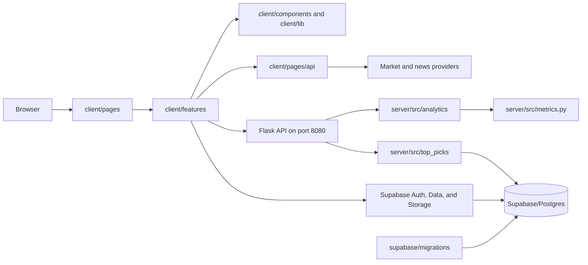

# Contributing to Financial-Investment-Tool

English · [简体中文](CONTRIBUTING.zh-CN.md)

This is the repository map and contributor runbook. It answers four practical questions:

1. Which folder owns a behavior?
2. Where should a new change go?
3. Where should you start when something breaks?
4. Which checks prove the change is safe?

The repository is a monorepo with a Next.js frontend, a Flask analytics API, and a versioned Supabase schema. Consistency here means clear ownership, not making every feature contain the same folders.

## First ten minutes

Use Git, Node.js 22 or newer, and Python 3.10 or newer. Docker Desktop and the Supabase CLI are optional unless you work on authenticated database flows or schema changes.

```bash
git clone <repository-url>
cd Financial-Investment-Tool/client
npm ci
npm run dev
```

The frontend opens at `http://127.0.0.1:3000`. Portfolio metrics and Top Picks also need Flask. In a second terminal from the repository root:

```bash
cd server
python -m venv .venv
source .venv/bin/activate
python -m pip install -r requirements-dev.txt
python -m src.server
```

On PowerShell, activate with `.\.venv\Scripts\Activate.ps1` instead of the `source` command.

The Flask API opens at `http://127.0.0.1:8080`. See [Local setup](#local-setup) for environment details.

## Architecture at a glance



The ownership rule is:

- `client/pages` decides which URL enters which feature.
- `client/features` owns product behavior and feature UI.
- `client/components` and `client/lib` contain genuinely cross-feature code.
- `client/pages/api` protects provider calls that must execute server-side in Next.js.
- `server/src/routes` translates HTTP into domain calls.
- `server/src/analytics` and `server/src/top_picks` own backend business behavior.
- `supabase/migrations` is the versioned source of truth for schema and authorization.

## Repository map

### Root

| Path                    | Responsibility                                              | Change it when                                                |
| ----------------------- | ----------------------------------------------------------- | ------------------------------------------------------------- |
| `.github/`              | PR template and CI workflows                                | contributor checks or GitHub automation change                |
| `.vscode/`              | repository-specific editor recommendations                  | shared editor tooling changes                                 |
| `client/`               | Next.js app, browser state, Next API routes, frontend tests | user-visible behavior changes                                 |
| `server/`               | Flask app, financial analytics, Top Picks, backend tests    | metric, ranking, or Flask behavior changes                    |
| `supabase/`             | local config, migrations, seed data, schema reference       | tables, grants, RLS, storage, or persisted preferences change |
| `README.md`             | product overview and shortest setup path                    | the project entry point changes                               |
| `CONTRIBUTING.md`       | canonical English map and workflow                          | ownership, setup, or contributor rules change                 |
| `CONTRIBUTING.zh-CN.md` | canonical Chinese map and workflow                          | the English guide changes                                     |

The root `package.json` is not the frontend install boundary. Run application npm commands from `client/`.

### Frontend: `client/`

| Path                       | Responsibility                                                  |
| -------------------------- | --------------------------------------------------------------- |
| `client/pages/`            | thin Pages Router entrypoints                                   |
| `client/pages/api/market/` | server-side quote, chart, sparkline and symbol-search proxies   |
| `client/pages/api/news/`   | server-side market, ticker, topic and search news proxies       |
| `client/features/`         | product modules organized by business capability                |
| `client/components/`       | cross-feature or application-shell UI                           |
| `client/lib/`              | neutral clients, contracts, route builders and server utilities |
| `client/assets/`           | images imported by TypeScript or CSS                            |
| `client/public/`           | files addressed directly by public URL                          |
| `client/styles/`           | global CSS and theme configuration                              |
| `client/tests/`            | cross-feature, environment and architecture contracts           |
| `client/tests/e2e/`        | Playwright user journeys and mock backends                      |
| `client/scripts/`          | frontend maintenance scripts                                    |
| `client/*.config.*`        | build, lint, test, CSS and TypeScript configuration             |

`client/components` is split by reusable surface:

- `charts/`: charts used by more than one product feature.
- `learning/`: learning and guide UI.
- `Modal/`: shared modal UI.
- `navigation/`: application navigation.
- `shared/`: low-level primitives with multiple real consumers.

Do not promote a feature component into `client/components` until it has a stable, feature-neutral contract and more than one consumer.

#### Feature ownership

| Feature        | Owns                                                         |
| -------------- | ------------------------------------------------------------ |
| `auth/`        | authentication UI, password policy, session-facing contracts |
| `community/`   | posts, comments, research feed, Markdown and persistence     |
| `guide/`       | guide-page composition                                       |
| `help/`        | help-page composition                                        |
| `home/`        | landing-page behavior                                        |
| `market-data/` | reusable browser quote and chart hooks                       |
| `market-news/` | news console, filters, topics, pagination and display state  |
| `portfolio/`   | metrics, Board/Focus/Observation, card state and preferences |
| `profile/`     | profile editing, avatar and account data                     |
| `top-picks/`   | ranked table, server query, preferences, columns and sorting |
| `watchlist/`   | research queue, symbols, quote/search and comparison         |

A feature contains only the folders it needs:

- `screens/`: page-level composition.
- `components/`: feature-owned UI.
- `hooks/`: stateful interaction and orchestration.
- `api/`: feature-specific remote request adapters.
- `data/`: persistence repositories and data contracts.
- `lib/`: pure feature-specific logic.
- `state/`: reducers, selectors, persistence and state migrations.
- `styles/`: feature-owned CSS modules.
- `types.ts`: feature contracts.
- `index.ts`: public feature boundary.

Do not create empty folders for symmetry.

#### Shared frontend libraries

| Path                         | Owns                                                  |
| ---------------------------- | ----------------------------------------------------- |
| `client/lib/market/`         | shared market-provider utilities                      |
| `client/lib/market-metrics/` | typed Flask metric client                             |
| `client/lib/news/`           | server-safe news contracts and provider orchestration |
| `client/lib/routes/`         | neutral route builders shared by independent features |
| `client/lib/server/`         | utilities restricted to server-side Next.js execution |
| `client/lib/supabase/`       | canonical browser Supabase client boundary            |
| `client/lib/apiBase.ts`      | Flask API and metric endpoint base                    |

Code in `client/lib` must not depend on a feature's private implementation.

### Backend: `server/`

| Path                              | Responsibility                                           |
| --------------------------------- | -------------------------------------------------------- |
| `server/src/server.py`            | app factory and dependency composition root              |
| `server/src/routes/`              | thin Flask blueprints: validate, call, serialize         |
| `server/src/analytics/`           | metric contracts, calculator registry and metric service |
| `server/src/top_picks/`           | Top Picks contracts, repository, analytics and service   |
| `server/src/composition/`         | construction of domain dependencies                      |
| `server/src/compat/`              | explicitly isolated legacy compatibility                 |
| `server/src/metrics.py`           | financial metric implementations                         |
| `server/src/market_primitives.py` | shared market-series primitives                          |
| `server/src/stocks.py`            | stock behavior used by current and legacy routes         |
| `server/src/supabase_client.py`   | backend Supabase client construction                     |
| `server/src/utils.py`             | small backend-neutral helpers                            |
| `server/tests/api/`               | Flask endpoint and response-contract tests               |
| `server/tests/top_picks/`         | Top Picks domain and service tests                       |
| `server/tests/`                   | analytics, architecture and regression tests             |
| `server/notebooks/`               | exploration only; never imported by runtime code         |
| `server/requirements*.txt`        | runtime and development dependencies                     |

Backend direction is `route -> service/domain -> repository/calculator`. Routes do not calculate metrics, and domain code does not know about Flask requests.

### Supabase: `supabase/`

| Path                                      | Responsibility                                             |
| ----------------------------------------- | ---------------------------------------------------------- |
| `supabase/migrations/`                    | ordered schema, grants, RLS, functions and data migrations |
| `supabase/config.toml`                    | local services and auth callback configuration             |
| `supabase/seed.sql`                       | deterministic local seed data                              |
| `supabase/schema_snapshot_2026_05_08.sql` | historical reference, not the daily edit target            |
| `supabase/.gitignore`                     | local Supabase artifact exclusions                         |

`supabase/.temp/` is generated by the CLI and must not be edited or committed.

### Generated and local-only folders

Do not edit or commit `node_modules/`, `client/.next/`, `client/coverage/`, `client/playwright-report/`, `client/test-results/`, `server/.venv/`, `.pytest_cache/`, `__pycache__/`, or `supabase/.temp/`.

Use `npm run clean` from `client/` to remove frontend build/test artifacts without deleting dependencies.

## Important request and data flows

| User flow              | Path through the code                                                                                                 |
| ---------------------- | --------------------------------------------------------------------------------------------------------------------- |
| Portfolio metric       | `pages/Portfolio.tsx` -> Portfolio feature -> `lib/market-metrics` -> Flask metric route -> analytics -> `metrics.py` |
| Portfolio preferences  | Portfolio controller -> `data/portfolioPrefs.ts` -> Supabase migration-defined table                                  |
| Top Picks              | `pages/TopPicks.tsx` -> controller -> `fetchTopPicks.ts` -> Flask route -> Top Picks service                          |
| Top Picks preferences  | `useTopPicksPreferences.ts` -> preference repository -> Supabase                                                      |
| Market News            | `pages/MarketNews.tsx` -> Market News feature -> `client/lib/news` -> Next news API -> providers                      |
| Watchlist quotes       | Watchlist -> market-data or Next market API -> providers                                                              |
| Auth/Profile/Community | owning feature repository -> `client/lib/supabase` -> Auth, Data or Storage                                           |

## Where to start when something breaks

| Symptom                           | First inspect                                | Then inspect or run                             |
| --------------------------------- | -------------------------------------------- | ----------------------------------------------- |
| URL opens the wrong page          | `client/pages/`                              | owning feature `index.ts` and `screens/`        |
| Whole feature fails               | feature screen                               | controller hook and nearest screen test         |
| Button, dialog or filter is wrong | feature `components/`                        | interaction test and hook                       |
| State resets after navigation     | feature `hooks/` or `state/`                 | repository and state-migration tests            |
| Portfolio mode is wrong           | `client/features/portfolio/`                 | reducer, geometry, workspace and E2E tests      |
| Portfolio chart is clipped        | chart component and owner CSS module         | component and Portfolio E2E tests               |
| Portfolio value or unit is wrong  | client metric registry                       | backend analytics, `metrics.py`, metric tests   |
| Top Picks order is wrong          | request sort and metadata                    | backend Top Picks analytics/service tests       |
| Top Picks preferences are wrong   | Top Picks hooks and repository               | migration contract and controller tests         |
| Market News URL state is wrong    | `client/lib/routes/marketNews.ts` and parser | route/navigation tests                          |
| News is empty or duplicated       | Market News controller                       | `client/lib/news`, Next handler, provider tests |
| Watchlist data is wrong           | Watchlist hooks                              | Next market API and market-data hooks           |
| Login/session is wrong            | Auth feature                                 | Supabase client, callback config, auth E2E      |
| Profile/Community write is denied | owning `data/` repository                    | latest grants and RLS migration                 |
| Flask status or payload is wrong  | `server/src/routes/`                         | called service/repository and API tests         |
| CI differs from local             | `.github/workflows/`                         | run the same runtime and command                |
| Static image is missing           | import site                                  | `assets` versus `public/assets` ownership       |

Move down one boundary at a time. Do not reorganize folders before isolating the failing behavior.

## Where to add a change

| Change                          | Correct location                                                 |
| ------------------------------- | ---------------------------------------------------------------- |
| New product page                | `client/features/<new-feature>/` plus one thin page entry        |
| Feature component               | owning feature `components/`                                     |
| Feature state/effect            | owning feature `hooks/` or `state/`                              |
| Pure feature calculation        | owning feature `lib/`                                            |
| Feature persistence             | owning feature `data/`                                           |
| Cross-feature UI primitive      | `client/components/shared/` after a second consumer exists       |
| Neutral utility                 | appropriately named `client/lib/` module                         |
| Public-URL asset                | `client/public/`; otherwise `client/assets/`                     |
| External provider call          | Next API handler plus provider/client code in `client/lib`       |
| Flask endpoint                  | `server/src/routes/` plus domain service and tests               |
| Financial metric                | backend metric contract/calculator/tests, then client registry   |
| Top Picks factor/field          | backend contract/service, serializer, client types and semantics |
| Table, view, function or policy | new `supabase/migrations` file plus repository/security tests    |

### Financial metric changes

1. Define input, output, unit, sign, nullability and minimum samples.
2. State annualization, benchmark, risk-free-rate and missing-data assumptions.
3. Add known-example and edge-case backend tests first.
4. Update calculator/contract and route only as required.
5. Update `metricRegistry.ts` for label, format, classification and chart kind.
6. Verify loading, invalid, empty, partial, stale and non-finite UI states.
7. Run Portfolio coverage and E2E.

The server is authoritative for calculation. The client is authoritative for honest explanation, formatting and interaction.

### Top Picks ranking changes

1. Define whether the field is an input, factor, displayed metric or metadata.
2. Update backend contracts, analytics/service and tests.
3. Keep sorting and pagination server-authoritative.
4. Update client response types, semantics, column registry and assumptions together.
5. Test sort direction, unavailable values and persisted preferences.

Never infer a ranking meaning only from a column label.

## Structural boundaries

- Pages stay thin and enter through `client/features/<feature>/index.ts`.
- Outside code imports a feature's public boundary, not its private folders.
- Shared helpers move to a neutral layer; one feature does not import another feature's internals.
- CSS modules are owned by the screen/component that renders them.
- React hook callbacks are stable when consumers use them as dependencies.
- Network/storage failures receive honest UI states.
- Flask routes validate and serialize; services and analytics own behavior.
- Repositories do not replace migrations.
- Feature tests colocate; cross-feature journeys live in `client/tests` or `server/tests`.

### When should a file become a folder?

Split when sections have different reasons to change, consumers need independent contracts, tests target independent behavior, ownership is unclear, or review has become unsafe. Prefer focused files around 200–400 lines, but cohesion matters more than an arbitrary count. Avoid empty folders and one-line wrapper layers.

## Local setup

### Frontend

From `client/`:

```bash
npm ci
cp .env.example .env.local
npm run dev
```

On PowerShell use `Copy-Item .env.example .env.local`.

- Any `NEXT_PUBLIC_` value reaches the browser. Never put a secret or service-role key there.
- Supabase auth/persistence needs a project URL and publishable key.
- News provider settings run only in Next API routes.
- `NEXT_PUBLIC_API_BASE` is optional; Flask defaults to `http://127.0.0.1:8080`.

### Backend

From `server/`:

```bash
python -m venv .venv
source .venv/bin/activate
python -m pip install -r requirements-dev.txt
python -m src.server
```

On PowerShell, activate with `.\.venv\Scripts\Activate.ps1` instead.

`server/.env.example` is a checklist; Flask does not automatically load it. Export `SUPABASE_URL` and `SUPABASE_KEY` in the process environment when needed.

### Supabase

Unit tests and mocked E2E journeys do not require live Supabase. For authenticated integration or migration work:

```bash
supabase --version
supabase start
supabase db reset
```

`supabase db reset` destroys and rebuilds the local database. Never add `--linked` unless an authorized maintainer intentionally targets a disposable remote environment.

## Verification

### Frontend

From `client/`:

```bash
npm test -- --runInBand
npm run test:portfolio-top-picks:coverage
npm run test:watchlist:coverage
npx tsc --noEmit --pretty false
npm run lint -- --no-cache
npm run build
npm run test:e2e
```

Portfolio/Top Picks configured surfaces require at least 80% statements, branches, functions and lines.

Check only changed files for formatting:

```bash
npx prettier --check <changed-file-1> <changed-file-2>
```

Do not mix unrelated repository-wide formatting into a functional PR. `npm run format` rewrites the frontend tree.

### Backend

From `server/`:

```bash
python -m pytest -q
python -m compileall -q src tests
python -m flake8 src tests --count --select=E9,F63,F7,F82 --show-source --statistics
```

### Database

```bash
supabase migration new <descriptive_name>
supabase db reset
supabase migration list --local
```

Review generated SQL before committing it. For remote deployment, an authorized maintainer coordinates:

```bash
supabase migration list --linked
supabase db push --dry-run
supabase db push
```

Never change the shared remote database directly in the Dashboard. Do not push merely because a migration exists on a branch.

Every public table used through `supabase-js` needs minimum explicit grants, RLS, operation-specific policies, ownership checks where applicable, and both `USING` and `WITH CHECK` for ownership-preserving updates. Grants decide whether the Data API can reach a table; RLS decides which rows are reachable.

## Contribution workflow

1. Search existing issues and PRs.
2. Branch from the intended base with a descriptive `feature/`, `fix/`, `refactor/` or `docs/` name.
3. Write a failing behavior or boundary test.
4. Implement the smallest coherent change.
5. Refactor while focused tests stay green.
6. Run affected full-stack checks.
7. Review `git diff` for secrets, artifacts and unrelated formatting.
8. Commit coherent units as `<type>: <description>`.
9. Open a PR explaining why, user impact, tests and deployment/migration needs.

For UI changes include screenshots. For financial semantics state assumptions. For schema changes identify the migration and target environment.

## Documentation strategy

GitHub automatically surfaces a root `CONTRIBUTING.md` during contribution flows. The Chinese guide lives beside it and links back here. Both are versioned with code so path and workflow changes are reviewed together.

A Wiki is not the primary repository map today. It may later hold product tutorials or operational/community material that changes independently. Code ownership and migration workflow belong beside the code.

This model follows:

- [GitHub contributor-guideline guidance](https://docs.github.com/en/communities/setting-up-your-project-for-healthy-contributions/setting-guidelines-for-repository-contributors).
- [Next.js contributing index](https://github.com/vercel/next.js/blob/canary/contributing.md).
- [VS Code source organization](https://github.com/microsoft/vscode/wiki/source-code-organization).
- [Ghostfolio development guide](https://github.com/ghostfolio/ghostfolio/blob/main/DEVELOPMENT.md).
- [Backstage contributor guide](https://github.com/backstage/backstage/blob/master/CONTRIBUTING.md).

## Pull-request checklist

- [ ] The change lives in the correct feature, shared layer or backend domain.
- [ ] New behavior has a regression test.
- [ ] Financial units and assumptions remain explicit.
- [ ] Loading, empty, error and stale states remain usable.
- [ ] No feature imports another feature's private implementation.
- [ ] Relevant tests, typecheck, lint, build and E2E pass.
- [ ] Changed files pass Prettier without unrelated churn.
- [ ] Database changes include reviewed SQL, minimum grants, RLS and tests.
- [ ] No secret, service-role key, production data or artifact is committed.
- [ ] Both language guides change when paths or workflow change.
