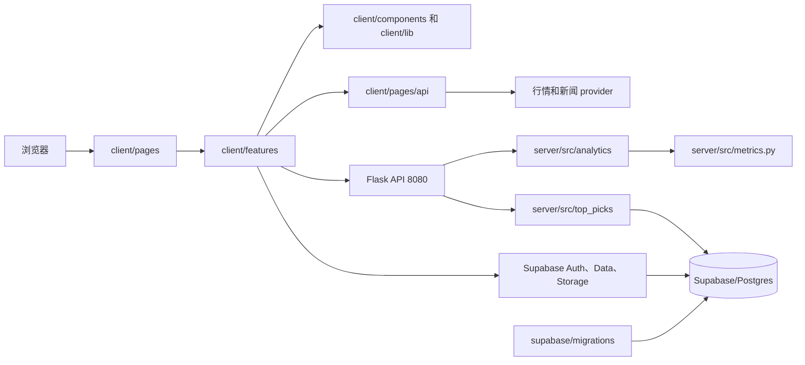

# 为 Financial-Investment-Tool 做贡献

[English](CONTRIBUTING.md) · 简体中文

这是一份仓库地图和 contributor runbook，主要回答四个实际问题：

1. 某个行为由哪个 folder 负责？
2. 新功能或修改应该加到哪里？
3. 出现问题时应该先去哪里找？
4. 哪些检查可以证明改动是安全的？

本仓库是一个 monorepo：前端使用 Next.js，分析服务使用 Flask，数据库结构和权限由 Supabase migration 进行版本管理。这里追求的是明确 ownership，而不是强迫每个 feature 拥有完全相同的文件夹。

## 前十分钟

准备 Git、Node.js 22 或更高版本，以及 Python 3.10 或更高版本。只有处理已登录数据库流程或 schema migration 时，才需要 Docker Desktop 和 Supabase CLI。

```bash
git clone <repository-url>
cd Financial-Investment-Tool/client
npm ci
npm run dev
```

前端地址是 `http://127.0.0.1:3000`。Portfolio metrics 和 Top Picks 还需要 Flask。请从仓库根目录打开第二个 terminal：

```bash
cd server
python -m venv .venv
source .venv/bin/activate
python -m pip install -r requirements-dev.txt
cp .env.example .env
python -m src.server
```

启动 Flask 前，请把 `server/.env` 中的两个占位值替换为前端所用的 Supabase
project URL 和 browser-safe publishable key。PowerShell 不运行 `source`，请改用
`.\.venv\Scripts\Activate.ps1` 激活环境，并用 `Copy-Item .env.example .env`
创建配置文件。

Flask API 地址是 `http://127.0.0.1:8080`。环境变量细节见[本地开发](#本地开发)。
Portfolio analytics 可以在没有 Supabase 时运行，但 Top Picks 需要这两个配置值。

## 整体架构



核心 ownership 规则：

- `client/pages` 决定 URL 进入哪个 feature。
- `client/features` 负责产品行为和 feature UI。
- `client/components` 与 `client/lib` 只放真正跨 feature 的代码。
- `client/pages/api` 代理必须在 Next.js server 侧执行的 provider 请求。
- `server/src/routes` 负责把 HTTP 请求转换成 domain 调用。
- `server/src/analytics` 和 `server/src/top_picks` 负责后端业务行为。
- `supabase/migrations` 是 schema 和 authorization 的版本化 source of truth。

## 仓库地图

### 根目录

| 路径                    | 负责什么                                | 什么时候修改                                  |
| ----------------------- | --------------------------------------- | --------------------------------------------- |
| `.github/`              | PR template 和 CI workflow              | contributor 检查或 GitHub automation 改变时   |
| `.vscode/`              | 仓库级 editor 推荐配置                  | 团队编辑器工具改变时                          |
| `client/`               | Next.js、浏览器状态、Next API、前端测试 | 用户可见行为改变时                            |
| `server/`               | Flask、金融分析、Top Picks、后端测试    | metric、ranking 或 Flask 行为改变时           |
| `supabase/`             | 本地配置、migration、seed、schema 参考  | table、grant、RLS、storage 或持久化偏好改变时 |
| `README.md`             | 产品介绍和最短启动路径                  | 项目入口改变时                                |
| `CONTRIBUTING.md`       | 英文 canonical 结构与流程               | ownership、setup 或贡献规则改变时             |
| `CONTRIBUTING.zh-CN.md` | 中文 canonical 结构与流程               | 英文指南内容改变时                            |

根目录 `package.json` 不是前端安装边界。应用相关 npm command 必须在 `client/` 运行。

### 前端：`client/`

| 路径                       | 负责什么                                                    |
| -------------------------- | ----------------------------------------------------------- |
| `client/pages/`            | 薄的 Pages Router entrypoint                                |
| `client/pages/api/market/` | quote、chart、sparkline、symbol search 等 server-side proxy |
| `client/pages/api/news/`   | market、ticker、topic、search news 的 server-side proxy     |
| `client/features/`         | 按产品能力组织的业务模块                                    |
| `client/components/`       | application shell 和跨 feature UI                           |
| `client/lib/`              | 中立 client、contract、route builder 和 server utility      |
| `client/assets/`           | 被 TypeScript 或 CSS import 的图片                          |
| `client/public/`           | 通过 public URL 直接访问的文件                              |
| `client/styles/`           | 全局 CSS 和 theme 配置                                      |
| `client/tests/`            | 跨 feature、环境和 architecture contract                    |
| `client/tests/e2e/`        | Playwright user journey 和 mock backend                     |
| `client/scripts/`          | 前端维护脚本                                                |
| `client/*.config.*`        | build、lint、test、CSS、TypeScript 配置                     |

`client/components` 按可复用 surface 组织：

- `charts/`：被多个产品 feature 使用的图表。
- `learning/`：学习和 guide UI。
- `Modal/`：共享 modal UI。
- `navigation/`：应用导航。
- `shared/`：已有多个真实 consumer 的底层 primitive。

不要因为“以后可能复用”就提前把 feature component 移到 shared。只有 contract 已经 feature-neutral，并且至少有第二个实际 consumer 时才上移。

#### 各 feature 的 ownership

| Feature        | 负责什么                                                  |
| -------------- | --------------------------------------------------------- |
| `auth/`        | 登录注册 UI、密码规则、session-facing contract            |
| `community/`   | post、comment、research feed、Markdown 和持久化           |
| `guide/`       | Guide 页面 composition                                    |
| `help/`        | Help 页面 composition                                     |
| `home/`        | landing page 行为                                         |
| `market-data/` | 可复用的 browser quote 和 chart hook                      |
| `market-news/` | news console、filter、topic、pagination 和 display state  |
| `portfolio/`   | metric、Board/Focus/Observation、card state 和 preference |
| `profile/`     | profile edit、avatar 和 account data                      |
| `top-picks/`   | ranked table、server query、preference、column 和 sorting |
| `watchlist/`   | research queue、symbol、quote/search 和 comparison        |

一个 feature 只创建真正需要的 folder：

- `screens/`：页面级 composition。
- `components/`：feature-owned UI。
- `hooks/`：有状态 interaction 和 orchestration。
- `api/`：feature-specific remote request adapter。
- `data/`：persistence repository 和 data contract。
- `lib/`：纯 feature-specific logic。
- `state/`：reducer、selector、persistence 和 state migration。
- `styles/`：feature-owned CSS module。
- `types.ts`：feature contract。
- `index.ts`：对外 public boundary。

不要为了目录看起来对称而创建空 folder。

#### 前端共享 library

| 路径                         | 负责什么                                            |
| ---------------------------- | --------------------------------------------------- |
| `client/lib/market/`         | 共享 market-provider utility                        |
| `client/lib/market-metrics/` | typed Flask metric client                           |
| `client/lib/news/`           | server-safe news contract 和 provider orchestration |
| `client/lib/routes/`         | 独立 feature 共享的中立 route builder               |
| `client/lib/server/`         | 只允许 Next.js server 侧使用的 utility              |
| `client/lib/supabase/`       | canonical browser Supabase client boundary          |
| `client/lib/apiBase.ts`      | Flask API 和 metric endpoint base                   |

`client/lib` 里的代码不能依赖某个 feature 的 private implementation。

### 后端：`server/`

| 路径                              | 负责什么                                             |
| --------------------------------- | ---------------------------------------------------- |
| `server/src/server.py`            | app factory 和 dependency composition root           |
| `server/src/routes/`              | 薄 Flask blueprint：validate、call、serialize        |
| `server/src/analytics/`           | metric contract、calculator registry、metric service |
| `server/src/top_picks/`           | Top Picks contract、repository、analytics、service   |
| `server/src/composition/`         | domain dependency construction                       |
| `server/src/compat/`              | 明确隔离的 legacy compatibility                      |
| `server/src/metrics.py`           | 金融 metric implementation                           |
| `server/src/market_primitives.py` | 共享 market-series primitive                         |
| `server/src/stocks.py`            | 当前与 legacy route 使用的 stock behavior            |
| `server/src/supabase_client.py`   | backend Supabase client construction                 |
| `server/tests/api/`               | Flask endpoint 和 response-contract test             |
| `server/tests/top_picks/`         | Top Picks domain 和 service test                     |
| `server/tests/`                   | analytics、architecture、regression test             |
| `server/notebooks/`               | 仅用于探索，runtime code 不得 import                 |
| `server/requirements*.txt`        | runtime 和 development dependency                    |

后端依赖方向是 `route -> service/domain -> repository/calculator`。Route 不计算 metric，domain code 不知道 Flask request。

### Supabase：`supabase/`

| 路径                                      | 负责什么                                            |
| ----------------------------------------- | --------------------------------------------------- |
| `supabase/migrations/`                    | 有序的 schema、grant、RLS、function、data migration |
| `supabase/config.toml`                    | 本地 service 和 auth callback 配置                  |
| `supabase/seed.sql`                       | 可重复的本地 seed data                              |
| `supabase/schema_snapshot_2026_05_08.sql` | 历史参考，不是日常修改目标                          |
| `supabase/.gitignore`                     | 本地 Supabase artifact 排除规则                     |

`supabase/.temp/` 由 CLI 生成，不能修改或 commit。

### 自动生成或仅本地使用的目录

不要修改或 commit `node_modules/`、`client/.next/`、`client/coverage/`、`client/playwright-report/`、`client/test-results/`、`server/.venv/`、`.pytest_cache/`、`__pycache__/` 或 `supabase/.temp/`。

在 `client/` 运行 `npm run clean` 可以清除前端 build/test artifact，但会保留 dependency。

## 重要 request 和 data flow

| 用户流程               | 代码路径                                                                                                              |
| ---------------------- | --------------------------------------------------------------------------------------------------------------------- |
| Portfolio metric       | `pages/Portfolio.tsx` -> Portfolio feature -> `lib/market-metrics` -> Flask metric route -> analytics -> `metrics.py` |
| Portfolio preference   | Portfolio controller -> `data/portfolioPrefs.ts` -> migration 定义的 Supabase table                                   |
| Top Picks              | `pages/TopPicks.tsx` -> controller -> `fetchTopPicks.ts` -> Flask route -> Top Picks service                          |
| Top Picks preference   | `useTopPicksPreferences.ts` -> preference repository -> Supabase                                                      |
| Market News            | `pages/MarketNews.tsx` -> Market News feature -> `client/lib/news` -> Next news API -> provider                       |
| Watchlist quote        | Watchlist -> market-data 或 Next market API -> provider                                                               |
| Auth/Profile/Community | owning feature repository -> `client/lib/supabase` -> Auth、Data 或 Storage                                           |

## 出问题时从哪里开始

| 症状                           | 先检查                                      | 然后检查或运行                                 |
| ------------------------------ | ------------------------------------------- | ---------------------------------------------- |
| URL 打开了错误页面             | `client/pages/`                             | owning feature 的 `index.ts` 和 `screens/`     |
| 整个 feature 不工作            | feature screen                              | controller hook 和最近的 screen test           |
| Button、dialog 或 filter 错误  | feature `components/`                       | interaction test 和 hook                       |
| Navigation 后 state 丢失       | feature `hooks/` 或 `state/`                | repository 和 state-migration test             |
| Portfolio mode 错误            | `client/features/portfolio/`                | reducer、geometry、workspace、E2E test         |
| Portfolio chart 被裁切         | chart component 和 owner CSS module         | component test 和 Portfolio E2E                |
| Portfolio 数值或 unit 错误     | client metric registry                      | backend analytics、`metrics.py`、metric test   |
| Top Picks 顺序错误             | request sort 和 metadata                    | backend analytics/service test                 |
| Top Picks preference 错误      | Top Picks hook 和 repository                | migration contract 和 controller test          |
| Market News URL state 错误     | `client/lib/routes/marketNews.ts` 和 parser | route/navigation test                          |
| News 为空或重复                | Market News controller                      | `client/lib/news`、Next handler、provider test |
| Watchlist 数据错误             | Watchlist hook                              | Next market API 和 market-data hook            |
| 登录或 session 错误            | Auth feature                                | Supabase client、callback config、auth E2E     |
| Profile/Community write 被拒绝 | owning `data/` repository                   | 最新 grant 和 RLS migration                    |
| Flask status/payload 错误      | `server/src/routes/`                        | 被调用的 service/repository 和 API test        |
| CI 与本地不同                  | `.github/workflows/`                        | 使用相同 runtime 和 command                    |
| 静态图片缺失                   | import site                                 | `assets` 与 `public/assets` ownership          |

一次只沿一个 boundary 向下检查。没有定位行为之前，不要先移动 folder。

## 新代码应该加到哪里

| 改动                          | 正确位置                                                       |
| ----------------------------- | -------------------------------------------------------------- |
| 新产品页面                    | `client/features/<new-feature>/` 加一个薄 page entry           |
| Feature component             | owning feature 的 `components/`                                |
| Feature state/effect          | owning feature 的 `hooks/` 或 `state/`                         |
| 纯 feature calculation        | owning feature 的 `lib/`                                       |
| Feature persistence           | owning feature 的 `data/`                                      |
| 跨 feature UI primitive       | 第二个 consumer 出现后放入 `client/components/shared/`         |
| 中立 utility                  | appropriately named `client/lib/` module                       |
| 通过 URL 访问的 asset         | `client/public/`；否则使用 `client/assets/`                    |
| 外部 provider call            | Next API handler 加 `client/lib` provider/client code          |
| Flask endpoint                | `server/src/routes/` 加 domain service 和 test                 |
| Financial metric              | backend contract/calculator/test，再更新 client registry       |
| Top Picks factor/field        | backend contract/service、serializer、client type 和 semantics |
| Table、view、function、policy | 新 `supabase/migrations` 文件，加 repository/security test     |

### 修改 financial metric

1. 定义 input、output、unit、sign、nullability 和 minimum sample。
2. 写明 annualization、benchmark、risk-free rate 和 missing-data assumption。
3. 先添加 known-example 和 edge-case backend test。
4. 只在必要处更新 calculator、contract、route。
5. 更新 `metricRegistry.ts` 的 label、format、classification 和 chart kind。
6. 验证 loading、invalid、empty、partial、stale、non-finite UI state。
7. 运行 Portfolio coverage 和 E2E。

Server 对 calculation 负责；client 对如实解释、format 和 interaction 负责。

### 修改 Top Picks ranking

1. 定义字段是 input、factor、displayed metric 还是 metadata。
2. 更新 backend contract、analytics/service 和 test。
3. Sorting 和 pagination 保持 server-authoritative。
4. 同时更新 client response type、semantics、column registry 和 assumption。
5. 测试 sort direction、unavailable value 和 persisted preference。

不能只根据 column label 推断 ranking 含义。

## 结构边界

- Page 保持薄，只通过 `client/features/<feature>/index.ts` 进入 feature。
- 外部代码 import feature public boundary，不 import private folder。
- 共享 helper 移到 neutral layer；一个 feature 不 import 另一个 feature 的内部实现。
- CSS module 由实际 render 它的 screen/component 所有。
- 当 consumer 把 callback 放进 dependency 时，React hook callback 必须 stable。
- Network/storage failure 必须有诚实、可操作的 UI state。
- Flask route 只负责 validate 和 serialize；service/analytics 负责行为。
- Repository 不能取代 migration。
- Feature test 与实现 colocate；跨 feature journey 放在 `client/tests` 或 `server/tests`。

### 什么时候把一个 file 拆成 folder？

当不同部分有不同 change reason、consumer 需要独立 contract、test 针对独立行为、ownership 不清晰，或 review 已经不安全时再拆。200–400 行是常见参考，但 cohesion 比行数更重要。避免空 folder 和只包一行的无意义 layer。

## 本地开发

### Frontend

在 `client/`：

```bash
npm ci
cp .env.example .env.local
npm run dev
```

PowerShell 使用 `Copy-Item .env.example .env.local`。

- 所有 `NEXT_PUBLIC_` value 都会进入浏览器，绝不能放 secret 或 service-role key。
- Supabase auth/persistence 需要 project URL 和 publishable key。
- News provider setting 只在 Next API route 中运行。
- `NEXT_PUBLIC_API_BASE` 是可选项；Flask 默认地址为 `http://127.0.0.1:8080`。

### Backend

在 `server/`：

```bash
python -m venv .venv
source .venv/bin/activate
python -m pip install -r requirements-dev.txt
cp .env.example .env
python -m src.server
```

PowerShell 改用 `.\.venv\Scripts\Activate.ps1` 激活环境，并使用
`Copy-Item .env.example .env` 创建配置文件。

`python -m src.server` 会先加载 `server/.env`，再创建 Flask app。请把占位值
替换为前端所用的同一个 Supabase project URL 和 browser-safe publishable key。
已有的 process environment 具有更高优先级。这个 public read path 绝不能使用
secret 或 service-role key。

### Supabase

Unit test 和 mocked E2E 不需要 live Supabase。已登录 integration 或 migration 工作使用：

```bash
supabase --version
supabase start
supabase db reset
```

`supabase db reset` 会销毁并重建本地数据库。除非 maintainer 明确授权且目标是 disposable remote environment，否则绝不能添加 `--linked`。

## 验证

### Frontend

在 `client/`：

```bash
npm test -- --runInBand
npm run test:portfolio-top-picks:coverage
npm run test:watchlist:coverage
npx tsc --noEmit --pretty false
npm run lint -- --no-cache
npm run build
npm run test:e2e
```

Portfolio/Top Picks 的 configured surface 要求 statements、branches、functions、lines 均至少 80%。

只检查本次 changed file 的 formatting：

```bash
npx prettier --check <changed-file-1> <changed-file-2>
```

不要在 functional PR 中混入无关的 repo-wide formatting。`npm run format` 会改写整个 frontend tree。

### Backend

在 `server/`：

```bash
python -m pytest -q
python -m compileall -q src tests
python -m flake8 src tests --count --select=E9,F63,F7,F82 --show-source --statistics
```

### Database

```bash
supabase migration new <descriptive_name>
supabase db reset
supabase migration list --local
```

Commit 前必须 review 生成的 SQL。Remote deployment 由获得授权的 maintainer 统一执行：

```bash
supabase migration list --linked
supabase db push --dry-run
supabase db push
```

不要直接在 Dashboard 修改 shared remote database，也不要因为 branch 里存在 migration 就自动 push。

所有通过 `supabase-js` 使用的 public table 都需要：最小 explicit grant、RLS、按 operation 区分的 policy、必要的 ownership check，以及 update 时同时检查 `USING` 和 `WITH CHECK`。Grant 决定 Data API 能否触达 table；RLS 决定可以触达哪些 row，这两者不能互相替代。

## 贡献流程

1. 搜索已有 issue 和 PR。
2. 从正确 base 创建描述清晰的 `feature/`、`fix/`、`refactor/` 或 `docs/` branch。
3. 先写一个失败的 behavior 或 boundary test。
4. 实现最小 coherent change。
5. 在 focused test 保持 green 的情况下 refactor。
6. 运行受影响的 full-stack check。
7. Review `git diff`，检查 secret、artifact 和无关 formatting。
8. 用 `<type>: <description>` 提交 coherent commit。
9. PR 中说明 why、user impact、test 和 deployment/migration requirement。

UI change 要提供 screenshot；financial semantics 要说明 assumption；schema change 要写明 migration 和 target environment。

## 文档策略

GitHub 会在 contribution flow 中自动展示根目录 `CONTRIBUTING.md`。中文指南与英文指南放在一起并互相链接。两份文档都和代码一起版本管理，因此 path、ownership、migration workflow 的变化能在同一个 PR 中被 review。

当前不把 Wiki 当作主要 repository map。未来 Wiki 可以承载与代码独立演进的产品教程、运营或 community 内容；code ownership 和 migration workflow 应留在 repository 中。

这套设计参考了：

- [GitHub contributor guideline](https://docs.github.com/en/communities/setting-up-your-project-for-healthy-contributions/setting-guidelines-for-repository-contributors)。
- [Next.js contributing index](https://github.com/vercel/next.js/blob/canary/contributing.md)。
- [VS Code source organization](https://github.com/microsoft/vscode/wiki/source-code-organization)。
- [Ghostfolio development guide](https://github.com/ghostfolio/ghostfolio/blob/main/DEVELOPMENT.md)。
- [Backstage contributor guide](https://github.com/backstage/backstage/blob/master/CONTRIBUTING.md)。

## Pull request checklist

- [ ] 改动位于正确的 feature、shared layer 或 backend domain。
- [ ] 新行为有 regression test。
- [ ] Financial unit 和 assumption 清晰且经过测试。
- [ ] Loading、empty、error、stale state 仍然可用。
- [ ] 不存在 feature import 另一个 feature private implementation。
- [ ] 相关 test、typecheck、lint、build、E2E 已通过。
- [ ] Changed file 通过 Prettier，没有无关 formatting churn。
- [ ] Database change 包含已 review 的 SQL、最小 grant、RLS 和 test。
- [ ] 没有 commit secret、service-role key、production data 或 artifact。
- [ ] Path 或 workflow 改变时，两种语言的指南都已同步。
